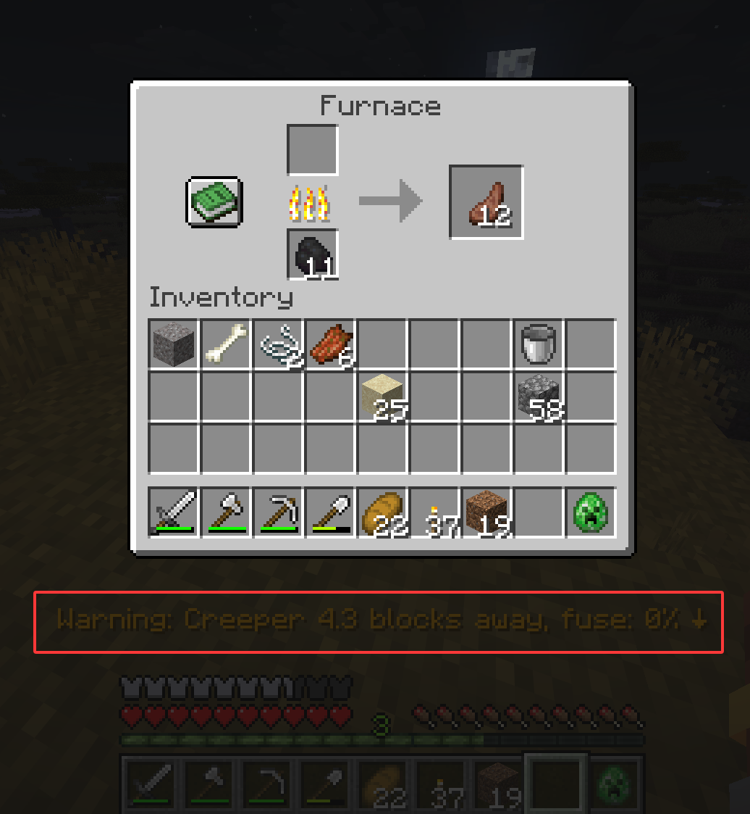
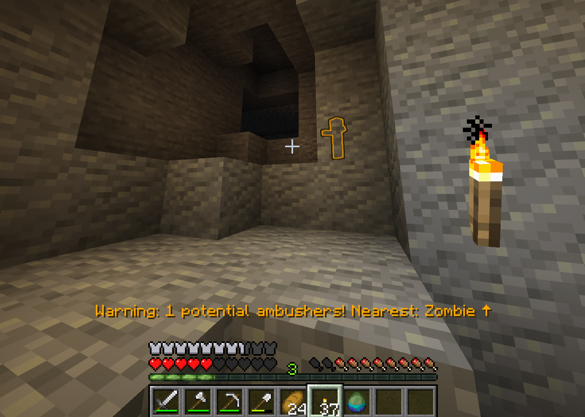
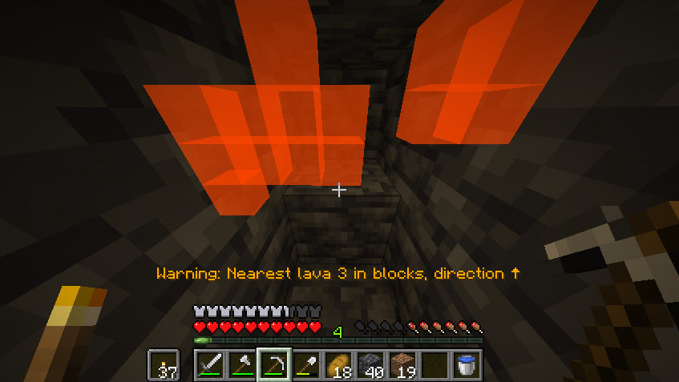
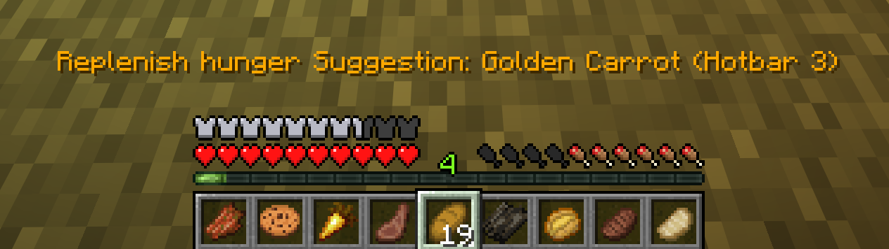

# Safeguard


**A client-side helper that watches your back in Minecraft survival.**

---

## Overview

Safeguard is a **client-side Fabric mod** that detects in-game dangers and helps you avoid them — through visual/audio
warnings, or optional automatic actions like pausing and disconnecting.

It does **not** introduce new items, mechanics, or dimensions. It does **not** make you invincible. It simply tries its
best to warn and protect you in case of danger. Everything runs locally on the client — no server-side support needed.

---

## Features

All protections are organized in a **tree-structured toggle system** — each detection and action belongs to a category
hierarchy (e.g. `Combat → Anti Creeper`). Disabling a category disables everything under it, giving you precise control
without drowning in options. The **AFK category** is off by default, so aggressive actions like auto-pause and auto-quit
won't interfere with normal gameplay — just enable it when you step away.

### Detections

All detections are **enabled by default** unless otherwise noted.

| Category       | Detection              | What it warns about                                                             |
|----------------|------------------------|---------------------------------------------------------------------------------|
| 💥 Combat      | **Anti Creeper**       | Nearby creepers, showing distance and fuse countdown                            |
| 💥 Combat      | **Anti Ambush**        | Hostile mobs and invisible players around you                                   |
| 💥 Combat      | **Projectile Tracker** | Projectiles heading your way (arrows, fireballs, etc.)                          |
| 🌍 Environment | **Anti Fall**          | Mining above caves/cliffs, dangerous falls, plus optional auto MLG              |
| 🌍 Environment | **Anti Suffocation**   | Being inside a wall or under falling blocks                                     |
| 🌍 Environment | **Lava Detection**     | Lava near your mining path                                                      |
| 🌍 Environment | **On Fire**            | When burning — also suggests items that can extinguish in your inventory        |
| 💊 Status      | **Damage Detection**   | Taking damage (triggers auto-pause / quit — but AFK category is off by default) |
| 💊 Status      | **Low Health**         | Health dropping below thresholds (red vignette + optional auto actions)         |
| 💊 Status      | **Low Hunger**         | Hunger running low, with smart food recommendations                             |

### Protection Actions

Actions are triggered by detections. Each can be toggled on/off independently.

| Type             | Action                                      | Default     |
|------------------|---------------------------------------------|-------------|
| 🛡️ Active/AFK    | **Auto Pause** [^2]                         | ✅ on [^1]  |
| 🛡️ Active/AFK    | **Auto Quit** [^2]                          | ❌ off [^3] |
| 🛡️ Active/Other  | **Auto MLG** (water / slime placement)      | ❌ off      |
| 💬 Passive/HUD   | **Action Bar Title** warning text           | ✅ on       |
| 💬 Passive/HUD   | **Red Vignette** (low-health screen effect) | ✅ on       |
| 💬 Passive/Other | **Entity Outline** glowing highlight        | ✅ on       |
| 💬 Passive/Other | **Block Highlight** through walls           | ✅ on       |
| 💬 Passive/Other | **Sound Alert**                             | ✅ on       |

[^1]: However, it is blocked by AFK category which is off by default.

[^2]: The two Actions will disable the "AFK" category when triggered (to prevent being triggered repeatedly).

[^3]: Auto Pause does not apply in multiplayer. If you want protection on a server, enable Auto Quit manually.

---

## Screenshots

### Anti Creeper



### Anti Ambush



### Lava Detection



### Low Hunger


Intelligently recommends food based on your current food and saturation level.

---

## Configuration

Open the config screen via **Mod Menu** or `/safeguard screen`.


Toggle detections and actions in a tree structure — disabling a category (e.g. "Combat")
disables everything under it. Config is saved to `.minecraft/config/safeguard.json`.

---

## Commands

```
/safeguard screen                        Open config screen
/safeguard detection <id> [state]        View or toggle a detection
/safeguard action <id> [state]           View or toggle an action
```

It is purely client-side and is never sent to the server. IDs use the format
`namespace:category/.../name`. The command provides **tab completion**.

---

## Dependencies

| Type        | Name                                              | Version   |
|-------------|---------------------------------------------------|-----------|
| Required    | [Fabric API](https://modrinth.com/mod/fabric-api) | ≥ 0.141.4 |
| Required    | [YACL](https://modrinth.com/mod/yacl)             | ≥ 3.8.2   |
| Recommended | [Mod Menu](https://modrinth.com/mod/modmenu)      | ≥ 17.0.0  |

---

## Feedback & Contributing

Bug reports and feature ideas are welcome on [GitHub Issues](https://github.com/yangguangMC/Safeguard/issues).

Pull requests are appreciated! For the current project structure, please read the context documentation,
[`contexts/CONTEXT.md`](contexts/CONTEXT.md). To work with AI agents, add that documentation to your context, and add
[`.clinerules/AGENTS.md`](.clinerules/AGENTS.md) as one of the agent's rule files. After making modifications, please
update `CONTEXT.md`.

---

## License

MIT — see [LICENSE.txt](LICENSE.txt).
